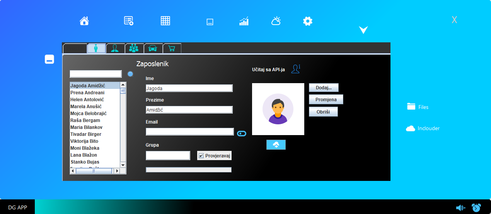
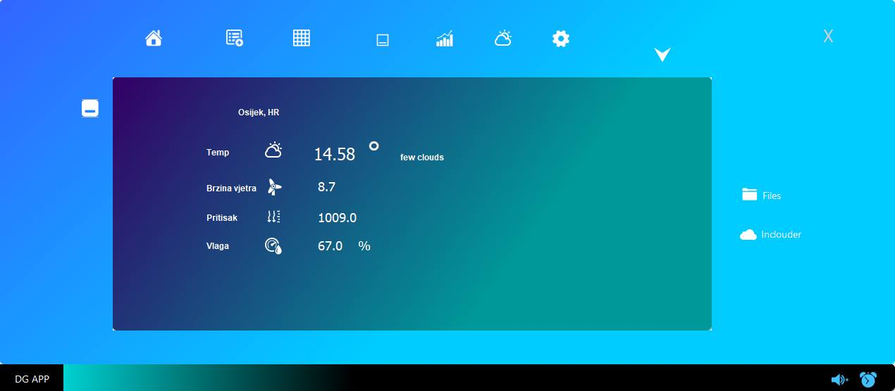
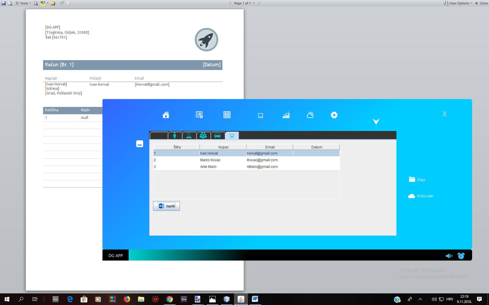
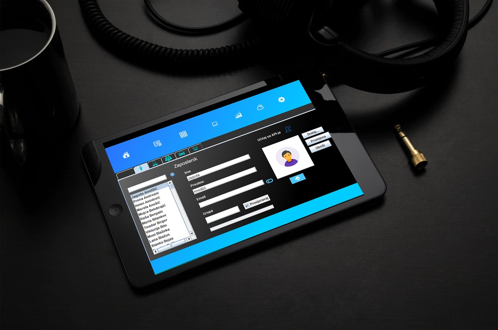

DG APP is a database-enabled, online-ready, offline-storage, Java powered standalone Application.

  - Insert Employes, managers, products and projects into database and assign them by groups.
  - Insert data online from browser form with PHP and display it into application in real-time.
  - Platform independent meaning that, the application source code can run on all operating systems. 
  - Magic

You can also:
  - Import and save Users from Browser, online API, or manually enter them inside application.
  - Insert products and projects and compare them by prices.
  - Export selected data as Word Document
  - Use the application to check the weather in your city.
  - Change the theme of application.

The application is designed to be installed on devices like tablets, Pc or standalone Raspberry PI devices.

### Plugins

DG APP uses a number of open source Jars to work properly:
All the jars are included and pushed to Github.

### Development

Want to contribute? Great!

DG APP uses Netbeans for fast developing and GUI building tools.

  

